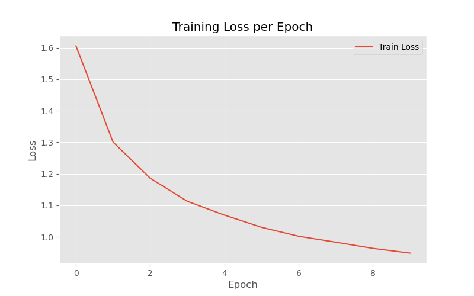
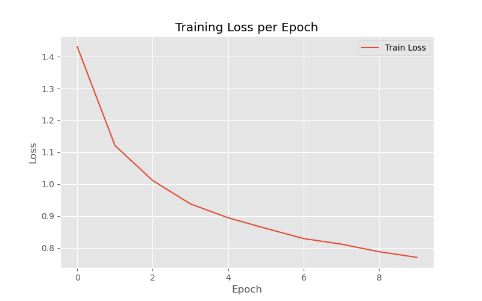
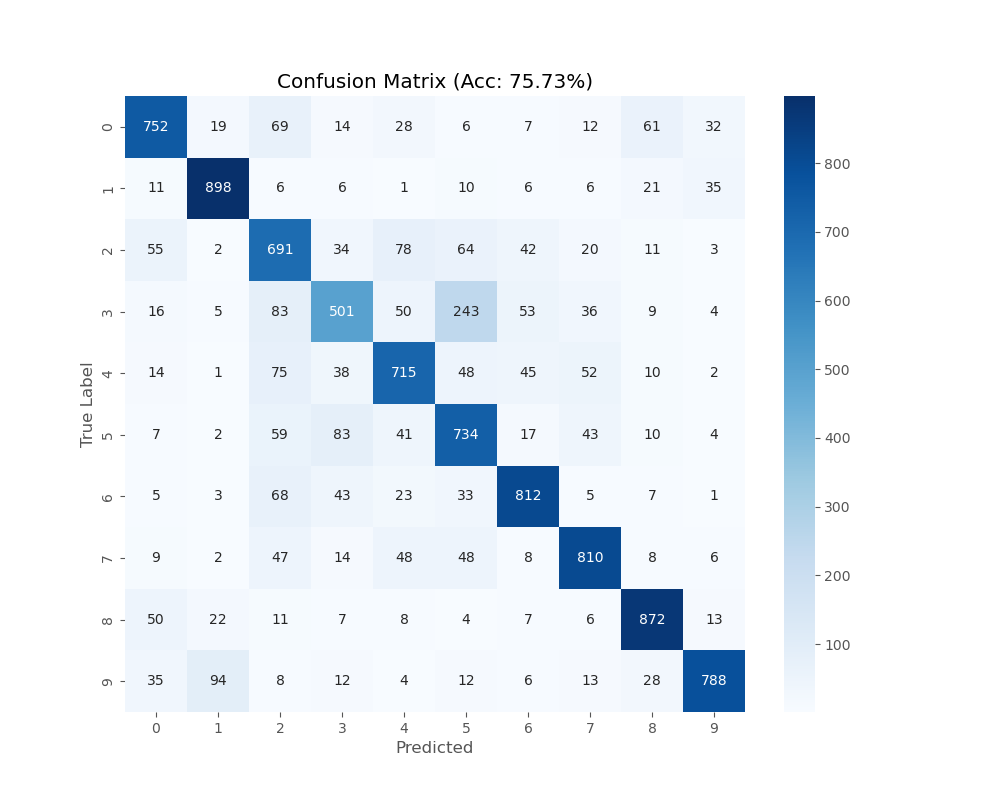

# 🌊 SoundDrop: Audio-Based Regularization for CNNs

> **Hypothesis:** Structured noise (Pink Noise / Complex Audio) serves as a better regularizer than binary Dropout.

This repository explores a novel approach to regularization in Deep Learning. Instead of zeroing out neurons (Standard Dropout), I implemented custom PyTorch layers that inject **structured acoustic noise** into the feature maps.

The experiment compares three approaches on the **CIFAR-10** dataset:
1.  **Standard Dropout** (Baseline)
2.  **WaterDrop** (Generated Pink Noise / $1/f$ spectral density)
3.  **AphexDrop** (Samples from Aphex Twin's "Formula", representing complex/glitch structures)

---

## 📊 Key Results

My experiments show that **additive structured noise consistently outperforms standard Dropout** on this CNN architecture.

| Method                     | Accuracy (Peak) | Precision | Recall | F1 Score | **Improvement vs Baseline** |
| :------------------------- | :-------------- | :-------- | :----- | :------- | :-------------------------- |
| **WaterDrop (Pink Noise)** | 75.73%          | 0.7604    | 0.7573 | 0.7565   | **+3.57%** 🚀               |
| **AphexDrop (IDM)**        | 74.86%          | 0.7485    | 0.7486 | -        | +2.72%                      |
| Standard Dropout           | 72.14%          | 0.7296    | 0.7214 | 0.7191   | —                           |

### 🔍 Robustness Validation (Random Seeds)
To ensure the results were not due to lucky initialization, I ran the **WaterDrop** model with multiple random seeds (`intensity=0.05`).
*   Run 1: **76.02%**
*   Run 2: **75.73%**
*   Run 3: **74.09%**
*   Run 4: **73.69%**

**Conclusion:** Even the worst run of WaterDrop (73.69%) outperforms the Standard Dropout baseline (72.14%).

---

## 🧪 Methodology

### Why Sound?
*   **Standard Dropout** assumes that removing information forces robustness.
*   **My Hypothesis:** Real-world data (images) contains structural noise (shadows, grain, lighting). Sound of water (Pink Noise) has a $1/f$ power spectral density, which is mathematically similar to the statistics of natural images. By injecting this "natural" noise, we train the network to be robust against realistic distortions.

### Implementation
The custom layer works by:
1.  Loading an audio buffer (or generating FFT-based noise).
2.  Normalizing the signal.
3.  Injecting it into the tensor during the `training` phase:
    $$Output = x + (Noise \times Intensity)$$

## 📈 Training Metrics

### Standart dropout

Epoch [1/10], Loss: 1.6059
Epoch [2/10], Loss: 1.3009
Epoch [3/10], Loss: 1.1863
Epoch [4/10], Loss: 1.1131
Epoch [5/10], Loss: 1.0693
Epoch [6/10], Loss: 1.0306
Epoch [7/10], Loss: 1.0021
Epoch [8/10], Loss: 0.9833
Epoch [9/10], Loss: 0.9638
Epoch [10/10], Loss: 0.9488
Accuracy: 72.14%

Precision: 0.7296, Recall: 0.7214, F1: 0.7191

### Water sample pink noize 

Epoch [1/10], Loss: 1.4315
Epoch [2/10], Loss: 1.1212
Epoch [3/10], Loss: 1.0112
Epoch [4/10], Loss: 0.9380
Epoch [5/10], Loss: 0.8943
Epoch [6/10], Loss: 0.8610
Epoch [7/10], Loss: 0.8292
Epoch [8/10], Loss: 0.8116
Epoch [9/10], Loss: 0.7879
Epoch [10/10], Loss: 0.7701
Accuracy: 75.73%

  
  
  
  

##  🛠️ How to use

~~~
from noise_layers import WaterNoiseLayer, AphexNoiseLayer
# Initialize model with custom noise

# intensity=0.05 was found to be optimal for CIFAR-10

self.drop1 = WaterNoiseLayer(intensity=0.05)

# OR

self.drop1 = AphexNoiseLayer(file_path="water.mp3", intensity=0.05)

  

# Use inside your forward pass (only works during model.train())

x = self.drop1(x)

~~~